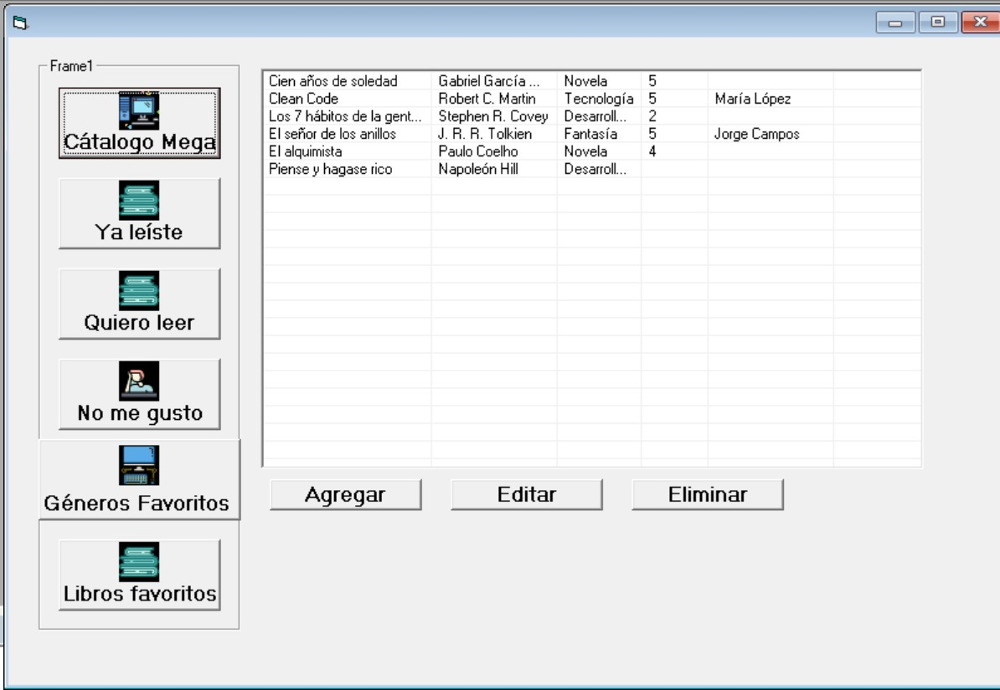

# HubLectura

**Desarrollado por:** Jalil Samas Mendoza Reyes

## Resumen
Este mini proyecto es una simulación de un Hub de Lectura. Desarrollado en Visual basic 6.

## Requerimientos técnicos

- Tecnologías utilizadas: Visual basic 6.

## Capturas de pagina en funcionamiento

