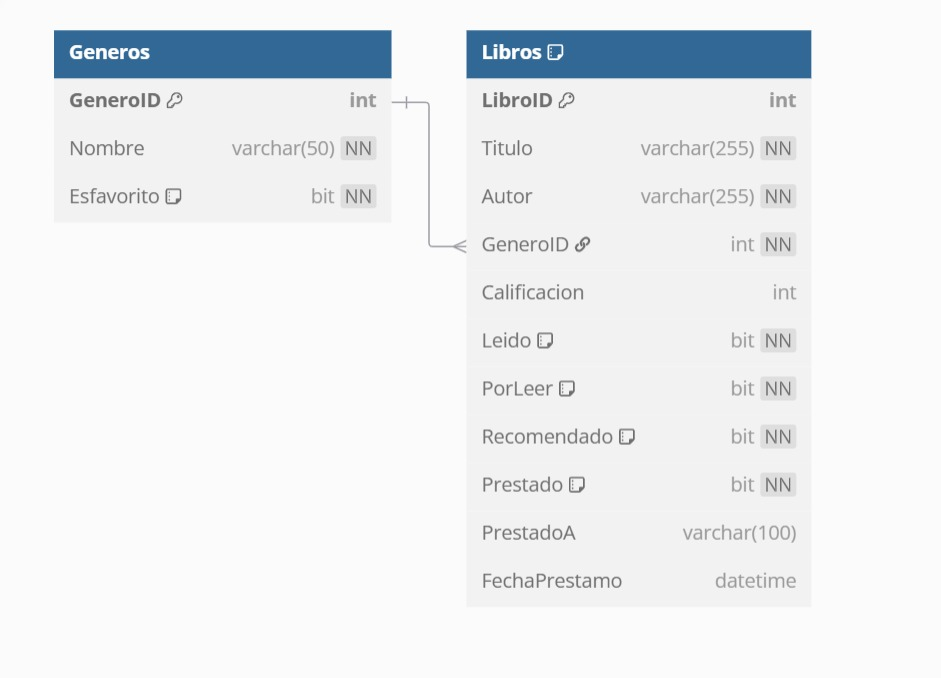

# HubLectura

**Desarrollado por:** Jalil Samas Mendoza Reyes

## Resumen
Este mini proyecto es una simulación de un Hub de Lectura. Desarrollado en Visual basic 6.

## Requerimientos técnicos

- Tecnologías utilizadas: Visual basic 6.

## Captura de pagina en funcionamiento

## Proceso de desarrollo

Fue complicado encontrar material que realmente me sirviera para realizar el mini proyecto. Así que principalmente me base en los videos del instructor para poder hacer funcionar la libreria.

## Diagrama entidad realción de la base de datos

## problemas conocidos

En realidad el proyecto funciona bastante bien, el unico problema es que tengo un bug visual, debido a que al inicio no habia instalado un paquete necesario, despues lo instale, pero siguio, confio en que en entornos correctos, no se presenta este error.

## Review 

| ¿Qué salió bien? | ¿Qué puedo hacer diferente? | ¿Qué no salió bien? |
|------------------|-----------------------------|---------------------|
| - Las funciones que contiene funcionan correctamente.   | - Se pudieron haber hecho más validaciones   | - Fue muy sencilla y no tome riesgos, debido a que estaba preocupado que ya no funcionara.

